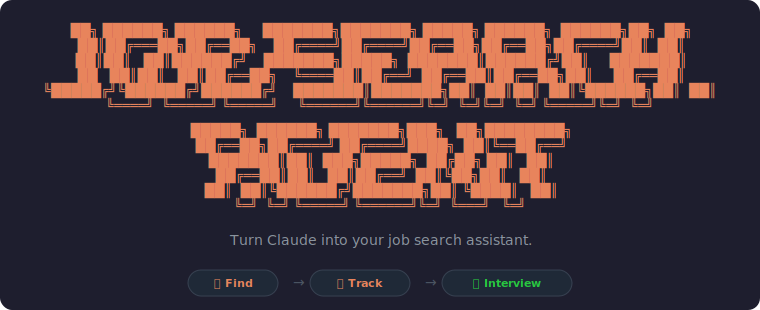

# Job Search Agent

A lightweight, on-demand job search toolkit for Cowork. No servers, no scrapers, no always-on machine. Everything runs when you ask it to, from a normal laptop.

If you've ever seen a "job search automation" setup that needs a dedicated computer running 24/7, a headless browser, a database, and a notification bridge — this is the opposite of that. Same ideas, none of the infrastructure. You point it at a search you trust, it pulls fresh results when you ask, filters them against what you actually want, and keeps a simple file-based record of where everything stands.

## What it does

- **Set up a search** — captures your target roles, location, comp floor, and dealbreakers once, then builds a reusable saved-search link you can run any time.
- **Scan on demand** — opens your saved search in your own logged-in browser, reads the current results, filters out the noise, and shows you the matches with a quick fit read.
- **Track applications** — a plain CSV in your own folder records every role: prospect, applied, interviewing, rejected. Opens in Excel, Numbers, or Google Sheets. Also gives you a pipeline scorecard and flags follow-ups going stale.
- **Prep for interviews** — paste a job description and get a full, role-specific interview guide: company research, role analysis, fit mapping against your background, scripted answers, smart questions to ask, and red flags to probe.
- **Automate it (optionally)** — explains how to run the scan on a schedule with a Cowork scheduled task (no hardware), and what it would take to build a full always-on pipeline if you ever want to.

## First-time setup

Say **"set up my job search"**. It asks a handful of questions about what you're looking for and your background (about five minutes), saves a profile, and helps you build a saved search. Every other tool reads that profile, so you only answer once.

## How to use

- "Set up my job search" → onboarding + saved search
- "Scan for jobs" / "any new roles?" → on-demand scan against your saved search
- "I applied to X" / "what's in my pipeline?" → tracker
- "Prep me for my interview with [Company]" + paste the JD → interview guide
- "Can this run automatically?" → automation options

## What you need

- **Cowork** (the desktop app you're reading this in).
- **A browser Claude can drive** for the scan step — the Claude-in-Chrome extension. If you don't have it, the scan falls back to a paste-the-results flow that works for everyone. See `CONNECTORS.md`.
- **A folder Cowork can write to** for your profile and tracker. Setup creates a `job-search/` folder there.

## Where your data lives

Everything stays in your own Cowork folder, in a `job-search/` subfolder:

```
job-search/
├── profile.md              # your search prefs + background (you control this)
├── applications.csv        # your tracker — opens in any spreadsheet app
└── interviews/
    └── <company>/guide.md  # interview guides
```

Nothing leaves your machine except the web searches and page reads you'd do anyway.

## The five tools

| Tool | Trigger | What it does |
|------|---------|--------------|
| `job-search-setup` | "set up my job search" | Onboards your profile and builds a saved search |
| `find-jobs` | "scan for jobs" | Pulls and filters fresh roles on demand |
| `application-tracker` | "I applied", "what's pending" | Maintains your CSV tracker + pipeline status |
| `interview-guide-engine` | paste a JD, "prep me" | Generates a role-specific interview guide |
| `job-search-automation` | "automate this" | Sets up scheduled scans + explains the full-pipeline path |
